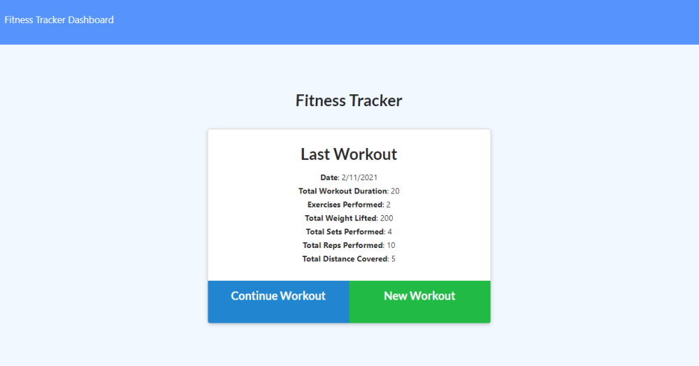
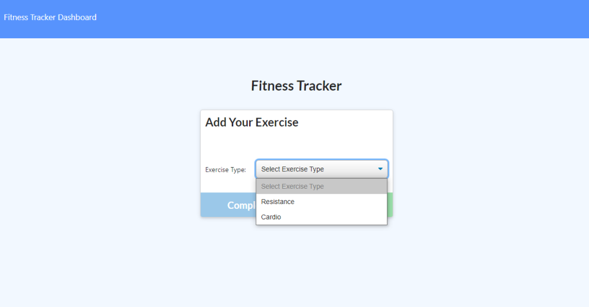
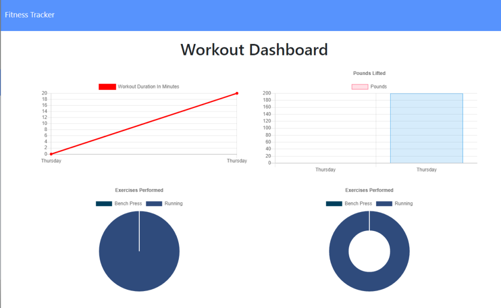

# Fitness_tracker

# Description

<!-- Some wording taken from instructions readme -->

This is a workout tracker which will allow a user to view, create, and track daily workouts. The user will also be able to log multiple exercises in a workout on a gien day and track the name, type, weight, sets, reps, and duration of exercise. If the exercise is cardio, the user will be able to track the distance traveled. The app will allow users to reach their fitness goals more quickly by tracking their workout progress.

## Screenshots

## Deployed App

[Deployed_App](https://smanter82-fitness-tracker-app.herokuapp.com/?id=6025ef756384540015751e41)

## Table of Contents

[Installation](#Installation)

[Usage](#Usage)

[Questions](#Questions)

## Installation

Deployed on Heroku

## Usage

*Create a workout
*Add as many exercises as desired to workout
*Complete workout, and return to homepage.
*View trends/workout data on dashboard.

## Questions

Contact me with any feedback or questions through GitHub or by email.

- [GitHub](https://github.com/smanter82)

- Email: sarahmanter@gmail.com

Some code on this application may have been done in collaboration with my Bootcamp study group classmates: https://github.com/arensalmela, https://github.com/dmaysteinman, https://github.com/EddiePhi, https://github.com/ReindeerCode, https://github.com/DustinErwin, https://github.com/Ewager1, https://github.com/mdjonestwo, https://github.com/shannonquinn91/Note-Taker, https://github.com/JesalDM
